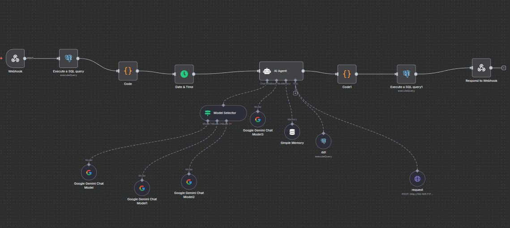

# KimyoSanoat AI Chatbot

---

## 📖 Description (English)

This chatbot was developed by **Tenzorsoft AI Team** for the **KimyoSanoat project**.
Its purpose is to receive natural language questions, analyze **200+ SQL tables**, generate **SQL queries**, and return the results in **JSON format**.

---

### 🔑 Key Features

* Covers more than **200+ tables**
* Uses **Semantic Search** to find the most relevant tables
* Applies **business rules** (employees, debtors/creditors, etc.)
* Returns results in **JSON format**
* Answers can be provided in both **Uzbek and English**

---

### 📦 JSON Response Example

```json
{
  "answer": "The total number of employees in the database is 24,884. (Jami xodimlar soni 24 884 nafarni tashkil qiladi.)",
  "query": "SELECT COUNT(DISTINCT p.id) FROM public.personal p;"
}
```

---

## 🏗️ Architecture

The project consists of two main layers:

### 1. Semantic Search Engine

* **Model**: `sentence-transformers/LaBSE`
* Converts a question into embeddings and retrieves the top **30 most relevant tables** from the SQL schema.
* Returns **DDL** of the tables.

**FastAPI Endpoint**:

* `/search` → returns top tables and their DDLs

**Sample Response:**

```json
{
  "question": "Employee information",
  "top_tables": [
    {
      "ddl": "CREATE TABLE public.personal (id int primary key, name text, ...);"
    }
  ]
}
```

---

### 2. AI Chatbot Engine

* Generates SQL queries based on semantic search results.
* Applies custom business rules:

  * `public.personal` → employees
  * `debtor_creditor1c` with `type` column → debtors/creditors
  * `date_created` column → time calculations
* Returns results in **JSON format**.
* Provides answers in **Uzbek and English**.

---

### 💡 Examples

**Q1: How many employees are there?**

```json
{
  "answer": "The total number of employees in the database is 24,884. (Jami xodimlar soni 24 884 nafarni tashkil qiladi.)",
  "query": "SELECT COUNT(DISTINCT p.id) FROM public.personal p;"
}
```

**Q2: How many debtors exist?**

```json
{
  "answer": "There are 1,245 debtors recorded. (Jami 1 245 ta debitor qayd etilgan.)",
  "query": "SELECT COUNT(*) FROM public.debtor_creditor1c WHERE type = 'debitor';"
}
```

---

## 🔗 Integration with n8n

The chatbot is fully integrated into **n8n (self-hosted)** for workflow automation.
It uses a **local language model (LLM)** running on the server with GPU acceleration.

### ⚙️ Server Specifications

* **GPU**: NVIDIA RTX 5090 (32 GB VRAM)
* **OS**: Ubuntu
* **Deployment**: Self-hosted n8n +  LLM currently we are using Gemini chat model but we are testing GPT-oss 20 and 120, Gemma 3,  Ollama and other models.

---

## 🗂️ Workflow Scheme

Below is the simplified workflow scheme used in **n8n** for integration:



---

## 🎥 Demo Video

A short demo of the chatbot integrated with **n8n** can be seen here:

<video controls src="demo.gif" title="Title"></video>

---

## 🇺🇿 O‘zbekcha Tavsif

Ushbu chatbot **Tenzorsoft AI Team** tomonidan **KimyoSanoat loyihasi** uchun ishlab chiqilgan.
Asosiy maqsad — foydalanuvchidan tabiiy tilda berilgan savollarni qabul qilish, **200+ SQL jadval** ustida tahlil qilish, SQL so‘rovlar yaratish va natijalarni **JSON formatida** qaytarish.

---

### 🔑 Asosiy Imkoniyatlar

* **200+ ta jadval**ni qamrab oladi
* Eng mos jadvallarni topish uchun **Semantik Qidiruv** ishlatiladi
* **Biznes qoidalari** qo‘llaniladi (xodimlar, debitor/kreditorlar va hokazo)
* Natijalar **JSON formatida** qaytariladi
* Javoblar **O‘zbek va Ingliz** tillarida berilishi mumkin

---

### 📦 JSON Natija Namunasi

```json
{
  "answer": "Jami xodimlar soni 24 884 nafarni tashkil qiladi",
  "query": "SELECT COUNT(DISTINCT p.id) FROM public.personal p;"
}
```

---

## 🏗️ Arxitektura

Loyiha ikki asosiy qavatdan iborat:

### 1. Semantik Qidiruv Mexanizmi

* **Model**: `sentence-transformers/LaBSE`
* Savolni embeddinglarga aylantiradi va SQL sxemadan eng mos **30 ta jadvalni** tanlaydi.
* Jadval **DDL** ma’lumotlarini qaytaradi.

**FastAPI Endpoint**:

* `/search` → eng mos jadvallar va ularning DDLlarini qaytaradi

---

### 2. AI Chatbot Mexanizmi

* Semantik qidiruv natijalariga asoslanib SQL so‘rovlarini yaratadi.
* Maxsus biznes qoidalarni qo‘llaydi:

  * `public.personal` → xodimlar
  * `debtor_creditor1c (type)` → debitor/kreditorlar
  * `date_created` → vaqt hisob-kitoblari
* Natijalarni **JSON formatida** qaytaradi.
* Javoblar **O‘zbek va Ingliz** tillarida taqdim etiladi.

---

## 🔗 n8n Integratsiyasi

Chatbot to‘liq holda **n8n (self-hosted)** tizimiga integratsiya qilingan.
Lokal til modeli (LLM) yordamida **GPU (RTX 5090, 32 GB)** asosida tezkor ishlaydi.

---

## 🗂️ Ish jarayoni sxemasi

Quyida **n8n** orqali ishlash sxemasi ko‘rsatilgan:


---

## 🎥 Demo Video

Chatbot va **n8n** integratsiyasi bo‘yicha demo videoni quyida ko‘rish mumkin:

<video controls src="demo.gif" title="Title"></video>

---

### 💡 Misollar

**Savol 1: Jami xodimlar soni nechta?**

```json
{
  "answer": "Jami xodimlar soni 24 884 nafarni tashkil qiladi",
  "query": "SELECT COUNT(DISTINCT p.id) FROM public.personal p;"
}
```

**Savol 2: Nechta debitor mavjud?**

```json
{
  "answer": "Jami 1 245 ta debitor qayd etilgan",
  "query": "SELECT COUNT(*) FROM public.debtor_creditor1c WHERE type = 'debitor';"
}
```
